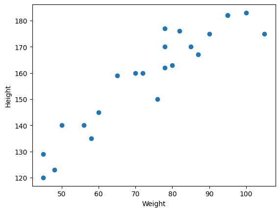
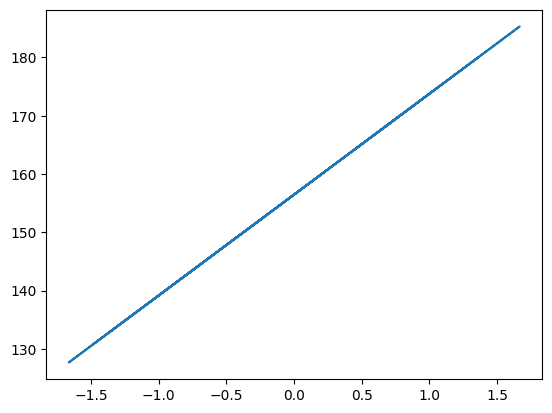

# 📊 Height Prediction using Simple Linear Regression

This project applies **Simple Linear Regression** to predict a person's **height** based on their **weight**. The dataset is already cleaned, and the model's performance is evaluated using various metrics.

---

## 📝 Project Overview

- **Input Feature (X):** Weight  
- **Target Variable (Y):** Height  
- **Goal:** Predict height based on given weight  
- **Model Used:** `LinearRegression` from `scikit-learn`  
- **Evaluation:** RMSE, MAE, R², Adjusted R²  
- **Model Accuracy:** **73.6%**

---

## 📂 Files Included

| File | Description |
|------|-------------|
| `File.ipynb` | Jupyter Notebook containing the complete code |
| `height-weight.csv` | Cleaned dataset of height and weight values |
| `scatterplot.png` | Scatter plot showing relationship between height and weight |
| `bestfitline.png` | Regression best-fit line over data |

---

## 📈 Visualizations

### 🔹 1. Relationship between Weight and Height
A simple scatter plot showing the linear relationship:



---

### 🔹 2. Best Fit Line (Linear Regression Prediction)
Line of best fit using the trained regression model:



---

## 📊 Performance Metrics

| Metric | Value (Example) |
|--------|-----------------|
| **Mean Squared Error (MSE)** | ✅ Calculated |
| **Root Mean Squared Error (RMSE)** | ✅ Calculated |
| **Mean Absolute Error (MAE)** | ✅ Calculated |
| **R² Score** | ✅ 0.736 (73.6%) |
| **Adjusted R² Score** | ✅ Calculated |

---

## 🧪 Statistical Modeling

- Also implemented using **OLS (Ordinary Least Squares)** from `statsmodels` for statistical insight.
- OLS results provide:
  - Intercept & coefficient
  - p-values
  - R² and adjusted R²
  - F-statistics and confidence intervals

---

## 🚀 How to Run

1. Clone or download this repository.
2. Install dependencies:
   ```bash
   pip install numpy pandas matplotlib seaborn scikit-learn statsmodels
3. Open and run File.ipynb in Jupyter Notebook.